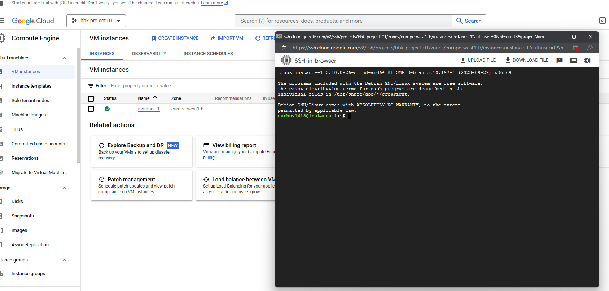
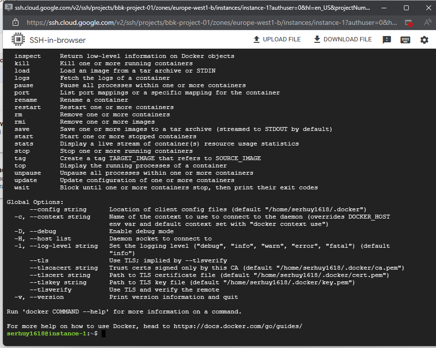
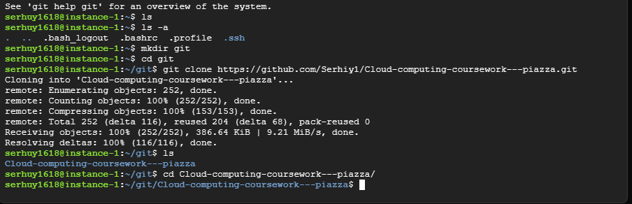
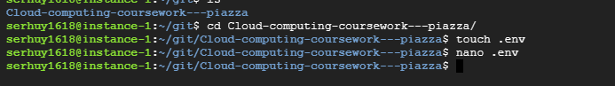
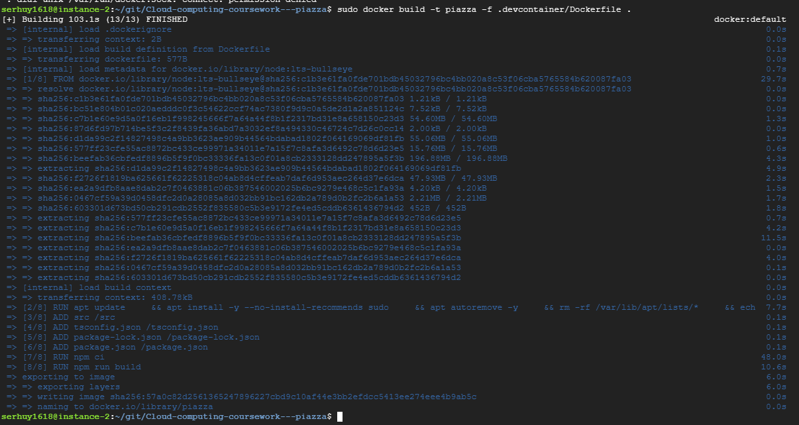
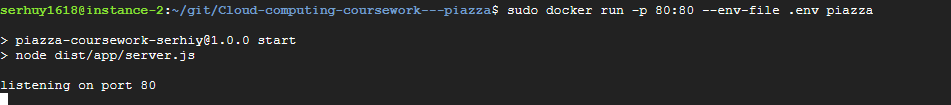
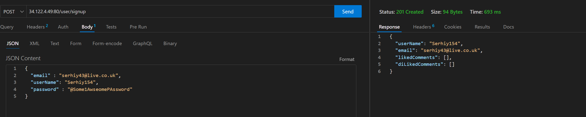
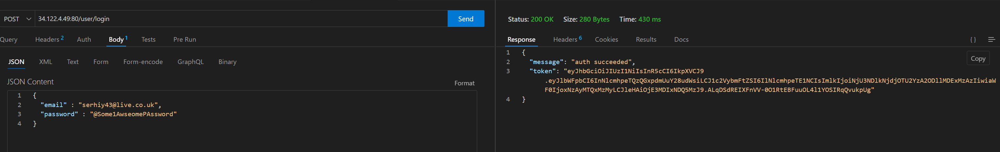
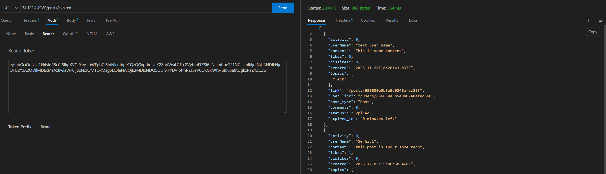

# Cloud computing coursework Report - Serhiy Pikho

## Phase A - Install and deploy software in virtualised environments

Github link: https://github.com/Serhiy1/Cloud-computing-coursework---piazza

1. The development environment uses a VS code [development container](https://code.visualstudio.com/learn/develop-cloud/containers).
   - The development container is based of the default nodeJs Docker image
   - The image used for the dev container can be re-used for deploying the service to the cloud
   - The dev container is set to install a set of default VS code plugins:
      1. `thunder-client` a postMan Clone that is present inside VS code
      2. `Spell checker`
      3. `Mongo DB` plugin for connecting and debugging the database
      4. `Jest` for running tests from the IDE

2. Setting up typescript compilation and default packages
   - This guide was used for getting node, express and typescript to work with each other https://blog.logrocket.com/how-to-set-up-node-typescript-express/
   - Typescript was selected due to the advantages that type checking and autocomplete provides with reducing bugs and speeding up development with autocomplete

3. setup Linting and formatting configurations
   - Eslint and prettier were selected as they are the industry defaults

4. Selecting packages and plugins for the project
   1. morgan - Logging middle ware for express JS
   2. Mongoose - For interacting with the mongo data base
   3. express-validator - validating user input
   4. bycrypt - hashing passwords so they are not stored as plain text
   5. jsonwebtoken - For creating the JSON web tokens for oauth
   6. Faker - For creating dummy data in the tests

5. Project structure - The folder structure of the project follows industry standards, all code is located in the `src` folder.
    - `.src/app/api/routes` subfolder contains specific handlers for the different API endpoints
    - `.src/app/models` subfolder contains the types for database / API interaction
    - `.src/app/utils` contains utility code and classes
    - `.src/testing` Contains all the test code

    The `./dist` folder contains the compiled javascript that is run by node.
    
<div style="page-break-after: always;"></div>

### Running the app locally.

1. Open the project in VS code
2. Copy `.env-empty-copy` and rename it to `.env`. Add all the secure details for the deployment
3. Install the remote development extension for VS code
4. Re-open the project inside the development container - This should start the docker image and attach VS code to it.
5. run `npm run dev` to start the dev server


## Phase B -  user Authentication

### file structure
- The file that implements the API routes in `src/app/api/routes/userRouter.ts`
- The file that implements the mongo models is in `src/app/models/user.ts`
- `src/app/utils/auth.ts` contains helper code

### API Paths
```
POST ${host}/user/signup -> user posts email, username and password to register themselves on the app
POST ${host}/user/login -> user posts email and password to authenticate themselves and receive a JWT token

GET ${host}/user -> User can see their own public details
GET ${host}/user/${userID} -> User can see the public details of other users
```

- A 200 response containing the Public view of the User is returned when signing up
- A 409 response is returned if an email or username is already in use
- A 400 response is returned if any of the fields are missing
- A 400 response is returned if the password complexity is not met: 8 char min, 1 capital, 1 number, 1 symbol

### When Signing up the following payload needs to be sent
`POST user/signup`
```json
{
  "email": "${email}",
  "password" : "${password}",
  "userName" : "${username}"
}
```

<div style="page-break-after: always;"></div>

### When logging in the following payload needs to be sent
`POST user/login`
```json
{
  "email": "${email}",
  "password" : "${password}"
}
```
A 400 response is returns if any of the fields are missing
A 403 response is returned when the username or password does not match
A 200 response is returned when successfully logging in `{message: "auth succeeded", "token" : "${jwt token}"}`

### Viewing a user

A 400 response is returned when the user ID does not exist

When A user is successfully found the returned format is
`GET user/${userId}`
```JSON
{
  "user": {
    "userName": "${username}",
    "email": "${email}",
    "likedComments": [
      "${mongo ID}"
    ],
    "diLikedComments": [
      "${mongo ID}"
    ]
  },
  "posts": [
    // ${Post JSON}
  ],
  "comments": [
    // ${Post JSON}
  ]
}
```

<div style="page-break-after: always;"></div>

### Database design for the user 
```js
const userSchema = new Schema<IUser>({
  _id: { type: Schema.Types.ObjectId, required: true },
  userName: { type: String, required: true },
  email: { type: String, required: true },
  passwordHash: { type: String, required: true },
  likedComments: { type: [Schema.Types.ObjectId], required: false, default: [] },
  diLikedComments: { type: [Schema.Types.ObjectId], required: false, default: [] },
});
```
**Some notable design decisions with the documents**
- The password is stored as a slated hash as part of security considerations
- Liked/disliked comments are stored on the User Document. This was a performance consideration. 
  - Posts will be interacted with by many users, Incrementing / decrementing a counter is an quick operation
  - User documents will not be under such a high interaction rate, so more expensive find and remove operations are done on them instead
- Posts are not stored on the User document, Posts made by a user a found by listing all Post documents with a matching user ID     


<div style="page-break-after: always;"></div>

## Phase C - Developing the API for creating and viewing posts

### file structure
- The file that implements the API routes in `src/app/api/routes/postRouter.ts`
- The file that implements the mongo models is in `src/app/models/post.ts`

### API Paths
```
GET ${host}/posts/topics -> return a list of valid topics
GET ${host}/posts/topics/${topicID} -> return a list of all the live posts that are not comments matching that topic
GET ${host}/posts/topics/${topicID}/expired -> return a list of all the expired posts that are not comments matching that topic


GET ${host}/posts -> return a list of all the live posts that are not comments without any topic filter
GET ${host}/posts -> return a list of all the expired posts that are not comments without any topic filter
GET ${host}/posts/${postID} -> view a single post and a list of all the comments on it

POST ${host}/posts -> Create a new post
POST ${host}/posts/${postID} -> Comment on a post

POST ${host}/posts/${postID}/like -> Like a post
POST ${host}/posts/${postID}/dislike -> dislike a post
```

### Global Rules
- User cannot like, dislike or comment on post that is marked as expired
- All Posts go expired depending on the `expiredTimeHours` environment variable
   - When attempting to interact with an expired comment as 400 response is returned

- All API endpoints on /post require a jwt token from the /login endpoint
   - When attempting to interact without a token a 403 response is returned

- All posts require atlas one topic entry in `"politics", "Health", "sport", "Tech"`

<div style="page-break-after: always;"></div>

### Liking, disliking and commenting on Posts

- when a person likes a post that they have already disliked it un-does the dislike and vice versa
- When a person likes/dislikes a post a second time it un-does the first action
- The parentId field is only present on comments
- A person cannot like or dislike their own post
- When Listing posts on a topic or globally, the comments are compressed into a count. To view individual comments you need to specifically `GET` a post

### selecting the order Posts are listed

users can append `?orderBy=` query to to the `/posts` and `/posts/topics/${topicID}` paths.
by default the ordering is by created date

```
?orderBy=Liked    # order by the most liked posts
?orderBy=Disiked    # order by the most Disliked posts
?orderBy=Activity    # order by the most liked and disliked posts
``` 

### post JSON example Response
```json
{
  "title" : "${title}"
  "userName": "${username}",
  "content": "${content}",
  "likes": 0,
  "dislikes": 0,
  "created": "2023-12-05T15:06:58.468Z",
  "topics": ["Tech"],
  "link": "${host}/posts/${mongo ID}",
  "user_link": "${host}/users/${mongo ID}",
  "post_type": "Post",  // or Comment
  "comments": 1,
  "status": "Active", // or "inactive",
  "Expires_in" : "1 hour"
}
```

<div style="page-break-after: always;"></div>

### Creating a post
`POST /posts`
```json
{
  "title" : "${title}",
  "content" : "${content}",
  "topics" : ["${valid topic}"]
}
```
### Commenting on a post
`POST /posts/${postId}`
```json
{
  "content" : "${content}",
}
```

### Database Design for the post document

This is the final schema for Posts and Comments
```js
const PostSchema = new Schema<IPOST>({
  _id: { type: Schema.Types.ObjectId, required: true },
  title: { type: String, required: false, default: null },
  ownerId: { type: Schema.Types.ObjectId, required: true, ref: "User" },
  userName: { type: String, required: true },
  parentId: { type: Schema.Types.ObjectId, required: false, default: null, ref: "Post" },
  childIds: { type: [Schema.Types.ObjectId], required: false, default: [], ref: "Post" },
  content: { type: String, required: true },
  likes: { type: Number, required: false, default: 0 },
  dislikes: { type: Number, required: false, default: 0 },
  activity: { type: Number, required: false, default: 0 },
  created: { type: Date, required: true },
  topics: { type: [String], enum: Object.values(ValidTopics), required: true },
});
```
- The Post Document represents both root posts and comments
- With performance in mind there the number of references to other documents is kept to a minimum
  - Since there are no deletions only append operations need to happen on the document.
  - Who liked or disliked a post is not tracked on the post itself
- Only the Created Date is stored on the document
  - If its active or not is calculated on the fly by the application, this allows for configuring the expiry time of a post without the the need for migrations and the ability for dynamic information such a countdown to the expiry
  
- Only immediate children are considered for the comment count, The design does allow for branching threads (tree like structures) counting comments across the tree would be extremely expensive as multiple database queries would be made.   


## Phase D - Testing the application

- Adhoc testing during the development is done with the postman clone thunder client.
- The `jest`, `supertest`, `MongoMemoryServer` packages are used for the structured testing. These where selected as recommendations from the following [guide](https://www.freecodecamp.org/news/how-to-test-in-express-and-mongoose-apps/).
- To run these tests you need to type into the terminal `npm run test`


### Reasons for the package selection  
- `Jest` it integrates with the jest vs code plugin and allows breakpoint debugging.
- `supertest` is a test framework specifically express app and integrates directly with it
- `MongoMemoryServer` is used to to create temporary databases, preventing pollution from run to run

### Test Coverage  
- `src/test/e2e.test.ts` contains all the tests specified by the worksheet
- `src/test/auth.test.ts` covers the sign up process
- `src/test/expired.test.ts` covers the behaviour of expired posts
- `src/test/post.test.ts` covers the behaviour of posting and commenting on the app
- `src/test/OrderBy.test.ts` contains all the tests specific to the order of listing posts
- `src/test/utils.ts` contains code for common functionality used in the tests

<div style="page-break-after: always;"></div>

### Complete run of all the tests  


## Phase E - Deploying the application to GCP

1. starting A google compute engine instance


2. install docker


3. clone the repo


4. Create the .env file with all the settings


5. Build the app with the following command `docker build -t piazza -f .devcontainer/Dockerfile .`


6. Run the app with the following command `docker run -p 80:80 --env-file .env piazza`


<div style="page-break-after: always;"></div>

7. Testing the app works across the internet

#### Note the Public IP address that is being used





## Phase G - Report Additional information
This Report was written as the application was being developed. 

### Tutorial Material
1. I learnt about express using this youTube [tutorial](https://www.youtube.com/playlist?list=PL55RiY5tL51q4D-B63KBnygU6opNPFk_q) series: 
2. I followed this to setup typescript for myp project https://blog.logrocket.com/how-to-set-up-node-typescript-express/
3. The Jest tutorial was used to set up testing in the repository https://jestjs.io/docs/getting-started


## Phase H - Submit quality scripts
Please see the Testing section for details on where to locate the tests and how to run them 